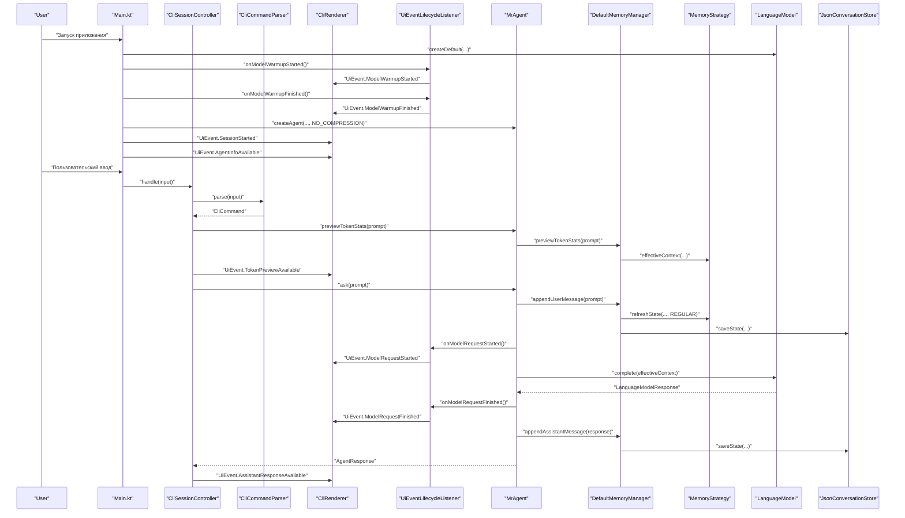
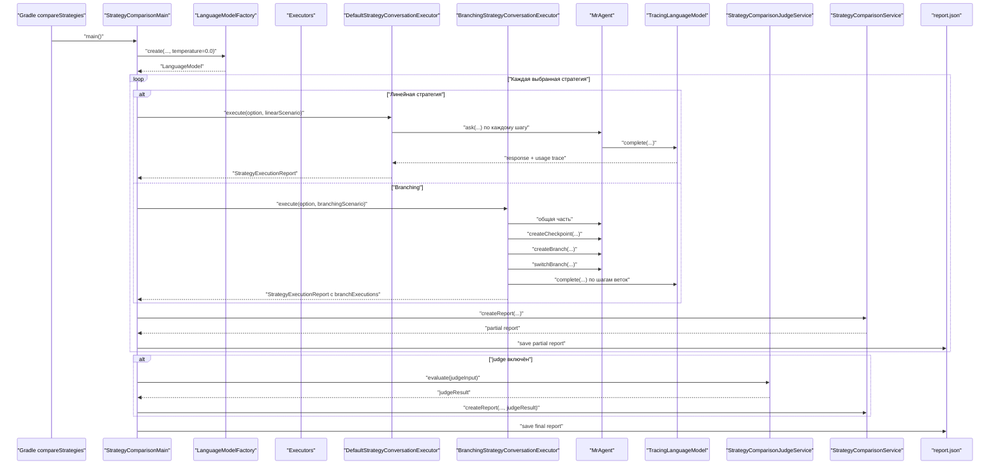
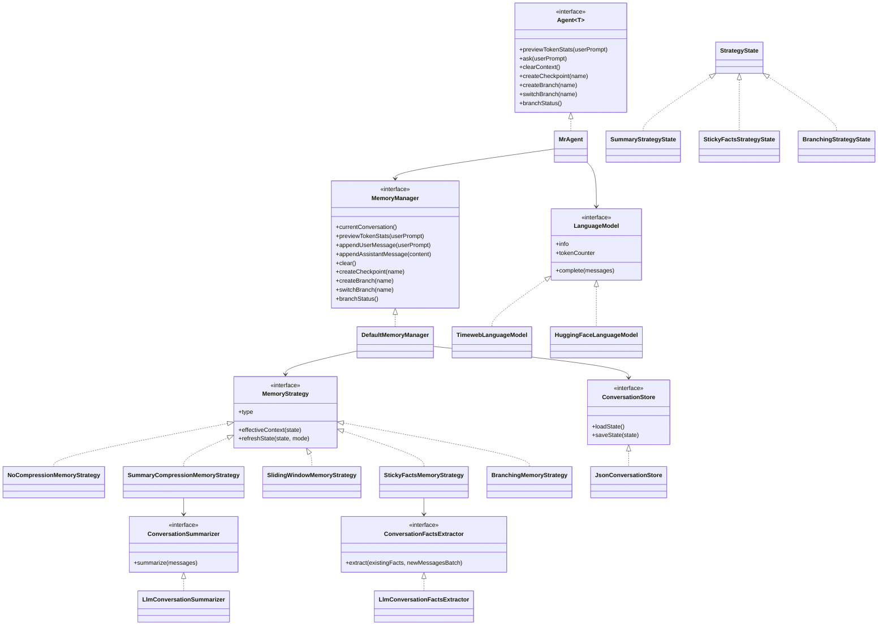

# ai_advent_day_10

CLI-агент для диалога с LLM по HTTP API с сохранением истории, несколькими стратегиями памяти и отдельным dev-режимом для сравнения этих стратегий на одном сценарии.

## Что умеет проект

- запускать интерактивный чат в консоли;
- переключать модель между `timeweb` и `huggingface`;
- хранить историю диалога по моделям в JSON;
- использовать 5 стратегий памяти:
  - без сжатия;
  - сжатие через rolling summary;
  - скользящее окно;
  - sticky facts;
  - ветки диалога;
- показывать локальную оценку токенов перед запросом;
- запускать отдельный comparison runner и сравнивать стратегии по:
  - токенам;
  - финальным ответам;
  - judge-оценке качества, стабильности и удобства.

## Быстрый старт

1. Скопируйте `config/app.properties.example` в `config/app.properties`.
2. Заполните токены для нужного провайдера.
3. Соберите и запустите проект:

```powershell
.\gradlew.bat build
.\gradlew.bat installDist
.\build\install\ai_advent_day_10\bin\ai_advent_day_10.bat
```

## Конфигурация

### Timeweb

- `AGENT_ID`
- `TIMEWEB_USER_TOKEN`

### Hugging Face

- `HF_API_TOKEN`

Если настроено несколько провайдеров сразу, по умолчанию выбирается первая доступная модель из [LanguageModelFactory.kt](C:/Users/compadre/Downloads/Projects/AiAdvent/day_10/src/main/kotlin/llm/core/LanguageModelFactory.kt).

## Команды в чате

### Общие команды

- `clear` — очищает контекст, сохраняя системное сообщение.
- `models` — показывает доступные модели и их статус.
- `use <id>` — переключает модель. При переключении заново выбирается стратегия памяти.
- `exit` / `quit` — завершает приложение.

### Команды для стратегии `Ветки диалога`

Эти команды доступны и имеют смысл только при стратегии `Ветки диалога`.

- `checkpoint [name]` — создаёт checkpoint текущего состояния диалога.
- `branches` — показывает активную ветку, последний checkpoint и список веток.
- `branch create <name>` — создаёт новую ветку от последнего checkpoint.
- `branch use <name>` — переключает диалог на выбранную ветку.

## Стратегии памяти

По умолчанию приложение стартует со стратегией `Без сжатия`.

При переключении модели через `use <id>` CLI предлагает выбрать одну из доступных стратегий памяти.

### 1. Без сжатия

Агент отправляет в модель всю сохранённую историю как есть.

### 2. Сжатие через summary

Когда в диалоге накапливается минимум 5 сообщений, стратегия начинает сворачивать старую часть истории в rolling summary:

- summary обновляется пачками по 3 сообщения;
- последние 2 сообщения остаются вне summary;
- в prompt уходят summary + свежий хвост сообщений.

### 3. Скользящее окно

В prompt уходят:

- системные сообщения;
- только последние 2 сообщения диалога.

Остальная история сохраняется, но не отправляется в модель.

### 4. Sticky Facts

Стратегия хранит отдельный блок `facts` и отправляет в модель:

- facts;
- последние 2 сообщения.

Сейчас facts обновляются батчами:

- после накопления 3 новых пользовательских сообщений;
- через отдельный LLM-вызов;
- в facts попадают цель, ограничения, предпочтения, решения и договорённости.

### 5. Ветки диалога

Стратегия позволяет:

- сохранить checkpoint общего состояния диалога;
- создать несколько независимых веток от одной точки;
- продолжить диалог в каждой ветке отдельно;
- переключаться между ветками без смешивания контекста.

Создание стратегий централизовано в [MemoryStrategyFactory.kt](C:/Users/compadre/Downloads/Projects/AiAdvent/day_10/src/main/kotlin/agent/memory/strategy/MemoryStrategyFactory.kt).

## Основной пользовательский сценарий

Ниже показано, как пользовательский запрос проходит через основные части приложения.



## Режим сравнения стратегий

Для сравнения стратегий есть отдельный dev-инструмент:

```powershell
.\gradlew.bat compareStrategies
```

По умолчанию он:

- запускается на 5 шагах;
- включает LLM judge;
- сравнивает все доступные стратегии.

### Полезные варианты запуска

Короткий прогон по умолчанию:

```powershell
.\gradlew.bat compareStrategies
```

Полный прогон на 12 шагах:

```powershell
.\gradlew.bat compareStrategies -PcomparisonSteps=12
```

Запуск только для выбранных стратегий:

```powershell
.\gradlew.bat compareStrategies -PcomparisonStrategies=no_compression,sticky_facts,branching
```

Запуск без judge:

```powershell
.\gradlew.bat compareStrategies -PcomparisonJudge=false
```

### Что делает comparison runner

- для линейных стратегий (`no_compression`, `summary_compression`, `sliding_window`, `sticky_facts`) прогоняет один сценарий сбора ТЗ;
- для `branching` запускает отдельный branch-aware сценарий:
  - общая часть;
  - checkpoint;
  - две ветки с независимым продолжением;
- собирает единый JSON-отчёт;
- при включённом judge делает дополнительный LLM-запрос для качественной оценки.

Итоговый отчёт сохраняется в:
[report.json](C:/Users/compadre/Downloads/Projects/AiAdvent/day_10/build/reports/strategy-comparison/report.json)

### Схема работы comparison mode



## Как читать comparison report

В консоль и в JSON-отчёт попадают, в частности, такие поля:

- `Локальные prompt-токены` — локальная оценка размера основного prompt.
- `Provider prompt-токены` — prompt-токены по данным провайдера.
- `Provider completion-токены` — токены, сгенерированные моделью.
- `Provider total-токены` — сумма prompt и completion по данным провайдера.
- `Внутренние LLM-вызовы по шагам` — сколько дополнительных обращений к модели стратегия делала внутри каждого шага.

Для стратегий с внутренними служебными вызовами, например `summary_compression` и `sticky_facts`, provider prompt-токены могут быть заметно больше локальных.

## Диаграмма классов



## Как читать проект

Если хочется быстро понять поток управления, удобный порядок такой:

1. [Main.kt](C:/Users/compadre/Downloads/Projects/AiAdvent/day_10/src/main/kotlin/Main.kt)
2. [CliCommands.kt](C:/Users/compadre/Downloads/Projects/AiAdvent/day_10/src/main/kotlin/CliCommands.kt)
3. [CliCommandParser.kt](C:/Users/compadre/Downloads/Projects/AiAdvent/day_10/src/main/kotlin/CliCommandParser.kt)
4. [CliSessionController.kt](C:/Users/compadre/Downloads/Projects/AiAdvent/day_10/src/main/kotlin/CliSessionController.kt)
5. [CliRenderer.kt](C:/Users/compadre/Downloads/Projects/AiAdvent/day_10/src/main/kotlin/ui/cli/CliRenderer.kt)
6. [MrAgent.kt](C:/Users/compadre/Downloads/Projects/AiAdvent/day_10/src/main/kotlin/agent/impl/MrAgent.kt)
7. [DefaultMemoryManager.kt](C:/Users/compadre/Downloads/Projects/AiAdvent/day_10/src/main/kotlin/agent/memory/core/DefaultMemoryManager.kt)
8. [MemoryStrategyFactory.kt](C:/Users/compadre/Downloads/Projects/AiAdvent/day_10/src/main/kotlin/agent/memory/strategy/MemoryStrategyFactory.kt)
9. [MemoryState.kt](C:/Users/compadre/Downloads/Projects/AiAdvent/day_10/src/main/kotlin/agent/memory/model/MemoryState.kt)
10. [StrategyState.kt](C:/Users/compadre/Downloads/Projects/AiAdvent/day_10/src/main/kotlin/agent/memory/model/StrategyState.kt)
11. [SummaryCompressionMemoryStrategy.kt](C:/Users/compadre/Downloads/Projects/AiAdvent/day_10/src/main/kotlin/agent/memory/strategy/SummaryCompressionMemoryStrategy.kt)
12. [StickyFactsMemoryStrategy.kt](C:/Users/compadre/Downloads/Projects/AiAdvent/day_10/src/main/kotlin/agent/memory/strategy/StickyFactsMemoryStrategy.kt)
13. [BranchingMemoryStrategy.kt](C:/Users/compadre/Downloads/Projects/AiAdvent/day_10/src/main/kotlin/agent/memory/strategy/BranchingMemoryStrategy.kt)
14. [StrategyComparisonMain.kt](C:/Users/compadre/Downloads/Projects/AiAdvent/day_10/src/main/kotlin/devtools/comparison/StrategyComparisonMain.kt)
15. [BranchingStrategyConversationExecutor.kt](C:/Users/compadre/Downloads/Projects/AiAdvent/day_10/src/main/kotlin/devtools/comparison/BranchingStrategyConversationExecutor.kt)
16. [JsonConversationStore.kt](C:/Users/compadre/Downloads/Projects/AiAdvent/day_10/src/main/kotlin/agent/storage/JsonConversationStore.kt)

## Тесты

Запуск тестов:

```powershell
.\gradlew.bat test
```

Покрываются, в частности:

- фабрика моделей;
- storage и mapper'ы;
- все стратегии памяти;
- branching-сценарии;
- comparison runner;
- judge-интеграция;
- форматирование token stats.

## IDE

Для навигации по коду и запуска тестов удобнее всего открыть проект в IntelliJ IDEA Community Edition.
